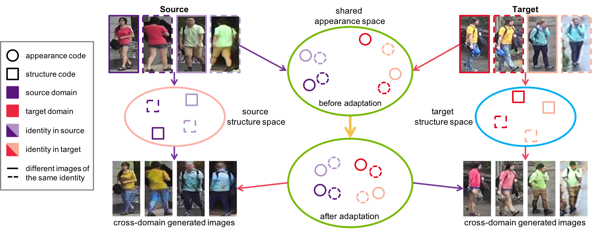

## Joint Disentangling and Adaptation for Cross-Domain Person Re-Identification


[[Project]](https://github.com/NVlabs/DG-Net-PP) [[Paper]](https://arxiv.org/pdf/2007.10315.pdf) [[Supp]](http://xiaodongyang.org/publications/papers/dgnetpp-supp-eccv20.pdf) [[Slides]](https://yzou2.github.io/files/DGNet++_slides.pdf)

Joint Disentangling and Adaptation for Cross-Domain Person Re-Identification, ECCV 2020 (Oral)<br>
[Yang Zou](https://yzou2.github.io/), [Xiaodong Yang](https://xiaodongyang.org/), [Zhiding Yu](https://chrisding.github.io/), [Vijayakumar Bhagavatula](http://users.ece.cmu.edu/~kumar/), [Jan Kautz](http://jankautz.com/) <br>

## Table of Contents
* [Features](#features)
* [Prerequisites](#prerequisites)
* [Getting Started](#getting-started)
    * [Installation](#installation)
    * [Dataset Preparation](#dataset-preparation)
    * [Testing](#testing)
    * [Training](#training)
* [Tips](#tips)
* [Citation](#citation)
* [Related Work](#related-work)
* [License](#license)

## Features
We have supported:
- Single-GPU training (fp32)
- Random erasing
- Visualize training curves 

## Prerequisites

- Python 3.6
- GPU memory >= 15G (fp32)
- NumPy
- PyTorch 1.1
- torchvision 0.2.1

Check `requirements_full.txt` for more details about packages and versions.

## Getting Started

### Installation
- Install [PyTorch](http://pytorch.org/) or from [Previous PyTorch Versions](https://pytorch.org/get-started/previous-versions/)

For example: 
```
conda install pytorch==1.1.0 torchvision==0.2.1 cudatoolkit=10.0 -c pytorch
```
```
pip install -r requirements.txt
```

### Dataset Preparation
Download the dataset Market-1501 ([[Google Drive]](https://drive.google.com/file/d/0B8-rUzbwVRk0c054eEozWG9COHM/view) or [[Baidu Disk]](https://pan.baidu.com/s/1ntIi2Op) with password: rqvf)


Download the dataset DukeMTMC-reID ([[Google Drive]](https://drive.google.com/open?id=1jjE85dRCMOgRtvJ5RQV9-Afs-2_5dY3O) or [[Baidu Disk]](https://pan.baidu.com/s/1jS0XM7Var5nQGcbf9xUztw) with password: bhbh)


Preparation: put the images with the same identity in one folder. You may use 
```bash
python prepare-market.py # for Market-1501
```
```bash
python prepare-duke.py # for DukeMTMC-reID
```
Note to modify the dataset path to your own path.

### Testing

We provide the trained DG-Net++ models which can be used for DG-Net++ performance evaluation. You may download the models from [[Google Drive]](https://drive.google.com/file/d/18rXbDnoTveZ85p4m9mORnikcBsU1rQQu/view?usp=sharing) or [[Baidu Disk]](https://pan.baidu.com/s/1fabMBnFYf1dLsykAkc9sYg) with password: r3d4, and then move these models to the `outputs/`

```
├── outputs/
│   ├── best-market2duke/
│   ├── best-duke2market/
```

Follow instructions in [`reid_eval/`](https://github.com/NVlabs/DG-Net-PP/tree/master/reid_eval) to evaluate the trained DG-Net++ models on Market2Duke and Duke2Market.

#### DG-Net++ evaluation
|   | Rank@1  | Rank@5  | Rank@10  | mAP |
|---|--------------|----------------|----------|-----------|
| Market2Duke | 79.3% |  87.9% |  89.9% | 64.4% |
| Duke2Market    | 82.6% | 91.4% | 93.9% | 64.0% |

### Training

#### Download the initial models
Models to start DG-Net++ training are provided at [[Google Drive]](https://drive.google.com/file/d/1MD4ybPs5znc38g3L1Phq7v-3TXuh5tpZ/view?usp=sharing) or [[Baidu Disk]](https://pan.baidu.com/s/1knpyTVu0Z4lyl7rmkzfK7w) with password: b3xn. Download and move them to the folder `models/`.

```
├── models
│   ├── imagenet-pretrained/
│   ├── dgnet/
│   ├── teacher/
```

The zip file contains (1) the model pre-trained on ImageNet; 2) DG-Net trained in source domain as the warm-up model for DG-Net++; 3) the teacher model. If you want to train DG-Net, please check [DG-Net](https://github.com/NVlabs/DG-Net). If you want to train the teacher model, please check [person re-id baseline](https://github.com/layumi/Person_reID_baseline_pytorch). And the trained DG-Net and teacher model should be placed in `models/dgnet` and `models/teacher` respectively.

#### Train DG-Net++
- Market2Duke 
1. Setup the yaml file. Check out `configs/market2duke.yaml`. Change the data_root field to the path of your prepared folder-based dataset, e.g. `../Market-1501/pytorch`.


2. Start training
```
python train.py --config configs/market2duke.yaml
```
Intermediate image outputs and model binary files are saved in `outputs/market2duke`.

3. Check the metrics and loss log
```
tensorboard --logdir logs/market2duke
```

- Duke2Market
1. Setup the yaml file. Check out `configs/duke2market.yaml`. Change the data_root field to the path of your prepared folder-based dataset, e.g. `../DukeMTMC-reID/pytorch`.


2. Start training
```
python train.py --config configs/duke2market.yaml
```
Intermediate image outputs and model binary files are saved in `outputs/duke2market`.

3. Check the metrics and loss log
```
tensorboard --logdir logs/duke2market
```

## Tips
We try our best to make our code deterministic by setting the random seeds. However, the randomness still exists. We run our code 10 times for each benchmark. For Duke2Market, the mAP ranges in [61.7%, 64.0%] with the average 63.2% and standard deviation 0.83%. For Market2Duke, the mAP ranges in [62%, 64.2%] with the average 62.8% and standard deviation 0.73%. You are welcome to let us know if you could fully fix the randomness issue.

Note the format of camera id and number of cameras. For some datasets (e.g., MSMT17), there are more than 10 cameras. You need to modify the preparation and evaluation code to read the double-digit camera id. For some vehicle re-id datasets (e.g., VeRi) having different naming rules, you also need to modify the preparation and evaluation code.

## Citation
Please cite the following papers if this repo helps your research:
```bibtex
@inproceedings{zou2020joint,
  title={Joint disentangling and adaptation for cross-domain person re-identification},
  author={Zou, Yang and Yang, Xiaodong and Yu, Zhiding and Vijayakumar, Bhagavatula and Kautz, Jan},
  booktitle={Proceedings of the European Conference on Computer Vision (ECCV)},
  year={2020}
}

@inproceedings{zheng2019joint,
  title={Joint discriminative and generative learning for person re-identification},
  author={Zheng, Zhedong and Yang, Xiaodong and Yu, Zhiding and Zheng, Liang and Yang, Yi and Kautz, Jan},
  booktitle={IEEE Conference on Computer Vision and Pattern Recognition (CVPR)},
  year={2019}
}
```

## Related Work
We would like to thank to the great project [DG-Net](https://github.com/NVlabs/DG-Net), which DG-Net++ is implemented upon. 

## License
Please check the LICENSE file. DG-Net++ may be used non-commercially, meaning for research or evaluation purposes only. For business inquiries, please contact [researchinquiries@nvidia.com](mailto:researchinquiries@nvidia.com).
